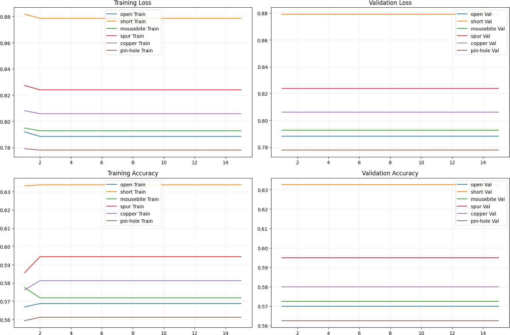
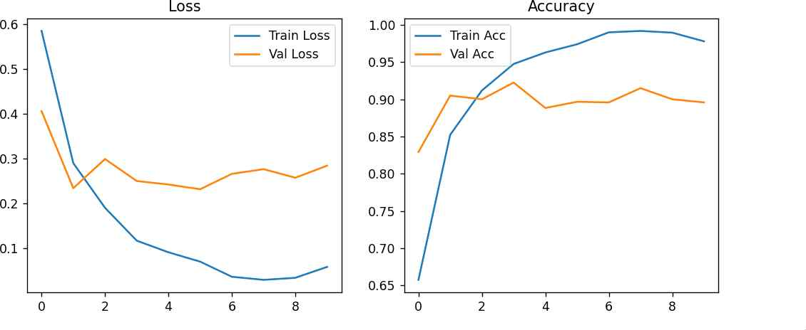
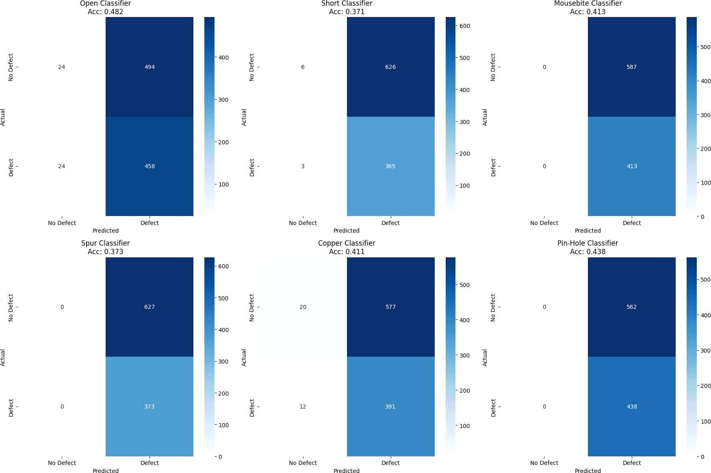
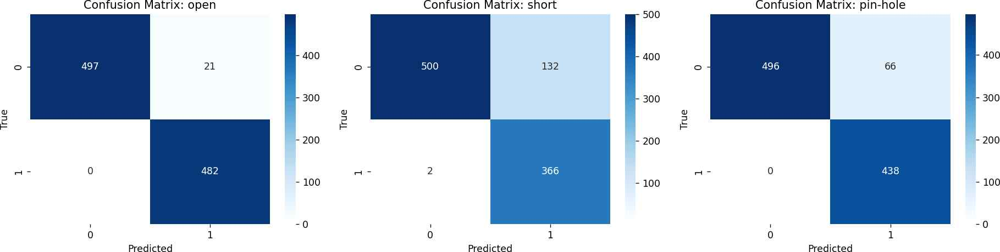
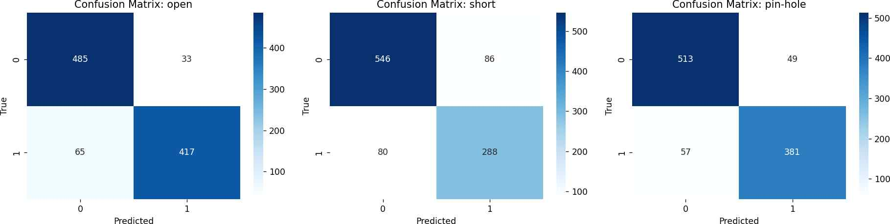
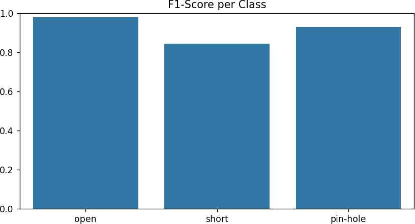
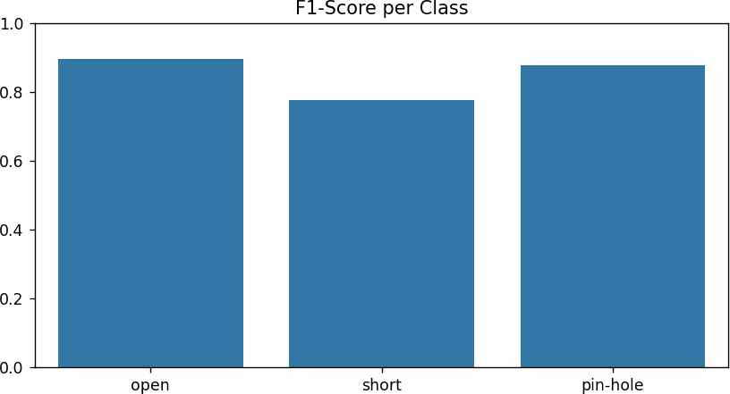
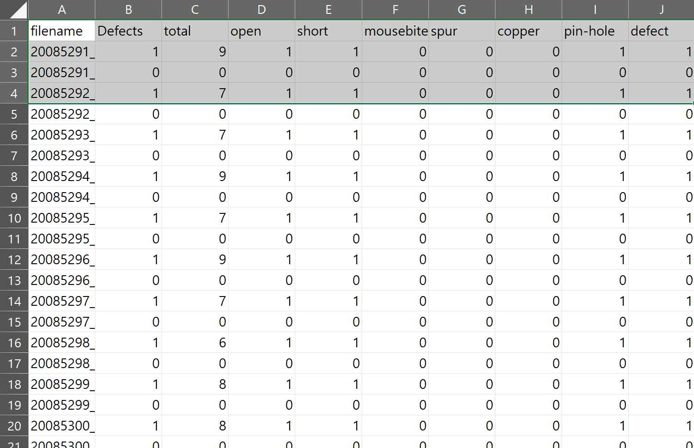

# PCB Defect Classification

## 프로젝트 개요
본 프로젝트는 **DeepPCB 데이터셋**을 기반으로 6종의 PCB 결함을 분류하는 모델을 개발한 연구입니다.  
결함 종류:

- **CNN1**: 각 결함별 개별 이진 분류 모델(Multi-Binary Classification)  
- **CNN2**: 단일 멀티레이블 분류(Multi-Label Classification) – 가장 높은 정확도 기록  
- **ResNet18**: 사전학습 기반 전이학습 모델

---

## 📂 데이터 구성
| 데이터 종류       | 경로                |
|-------------------|--------------------|
| 학습/검증 라벨     | `trainval_label.csv` |
| 테스트 라벨       | `test_label.csv`     |
| 학습 이미지       | `/train`            |
| 테스트 이미지     | `/test`             |

---

## 🛠 데이터 전처리
공통:
- 결함 여부: 각 결함 값 > 0 → `1` / 아니면 `0` 변환
- 리사이즈 후 모델별 전처리 적용

모델별:
- **CNN1**: Resize(224,224) + Flip/Rotate/Brightness Contrast 증강
- **CNN2**: Resize(640,640,3) (정규화 없음)
- **ResNet18**: Resize(224,224) + ImageNet 기준 정규화

---

## ⚙ 데이터 로더
- Framework: **PyTorch**
- Batch Size: CNN1=64, CNN2/ResNet=16
- Shuffle: 학습 데이터에만 적용
- Dataset Class: 모델 구조에 맞춰 커스터마이징

---

## 🧠 모델 구조

### 1️⃣ CNN1 – Multi-Binary Classification
Input (3x224x224)
→ Conv(3→32) + BN + ReLU + MaxPool + Dropout(0.2)
→ Conv(32→64) + BN + ReLU + MaxPool + Dropout(0.2)
→ Conv(64→128) + BN + ReLU + MaxPool + Dropout(0.2)
→ AdaptiveAvgPool2D(4x4) → Flatten
→ FC(2048→128) + ReLU + Dropout(0.3)
→ FC(128→1) → Sigmoid
- Loss: `BCEWithLogitsLoss` + pos_weight  
- Optimizer: Adam(lr=1e-3)  
- Epoch: 15 × 결함별 6회

---

### 2️⃣ CNN2 – Multi-Label Classification
Input (3x640x640)
→ Conv(3→32) + ReLU + MaxPool
→ Conv(32→64) + ReLU + MaxPool
→ Conv(64→128) + ReLU
→ AdaptiveAvgPool2D(1x1) → Flatten
→ FC(128→3) → Sigmoid
- Loss: `BCELoss`  
- Optimizer: Adam(lr=1e-3)  
- Epoch: 50  
- **Best Model** (Test Accuracy=0.929)

---

### 3️⃣ ResNet18 – Transfer Learning
Input (3x224x224)
→ ResNet18(pretrained=True)
→ FC(512→3) → Sigmoid
- Loss: `BCELoss`  
- Optimizer: Adam(lr=1e-4)  
- Epoch: 50

---

## 📊 학습 결과

### 📈 Accuracy & Loss 변화
| CNN1 | CNN2 | ResNet18 |
|------|------|----------|
|  |  |  |

---

### 🔍 Confusion Matrix
| CNN1 | CNN2 | ResNet18 |
|------|------|----------|
|  |  |  |

---

### 🏆 F1-Score
| CNN2 | ResNet18 |
|------|----------|
|  |  |

---

### 🎯 CNN2 Output

---

## 📌 성능 비교
| 모델   | Test Accuracy | 특징 |
|--------|--------------|------|
| CNN1   | 0.438        | 불균형 대응 유리, 훈련 복잡 |
| CNN2   | **0.929**    | 단일 모델, 최고 성능 |
| ResNet | 0.893        | 전이학습 기반, 빠른 수렴 |

